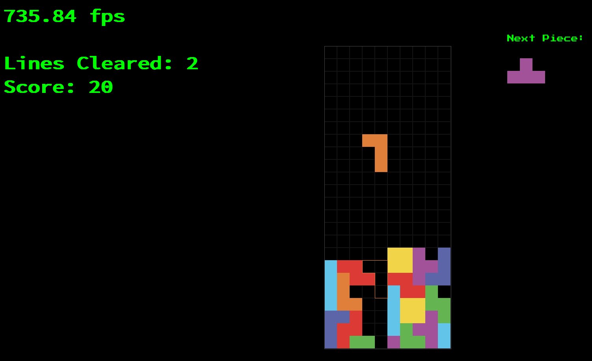

# Tetris
Mostly following rules as outlined by the [Tetris Guideline](https://tetris.fandom.com/wiki/Tetris_Guideline).

# Roadmap
- ✅ Keypresses queue action for next game sim tick instead of instantly applying.
- ✅ PlayField improvements -> Correct grid parameters, correct piece placement, etc.
- ✅ Drop indicator.
- ☐ Wall kicks.
- ☐ Key bindings.
- ☐ Menus.
- ☐ Game stats.
- ☐ Sound.
- ☐ Game controller support.
- ☐ User preferences.
- ☐ Configurable game rules.
- ✅ Resume game aka keep playing after reboot.
- ☐ Custom colour schemes (also creates some accessibility support).
- ✅ Replay system (through input recording or action events).
- ☐ Macro for defining shapes using a method like tetrominos.txt.
- ☐ Quake style console.

